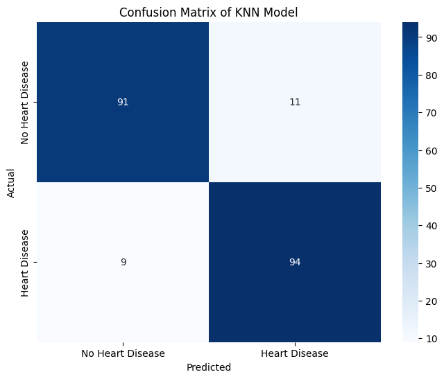
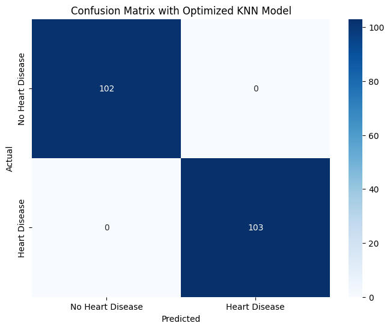
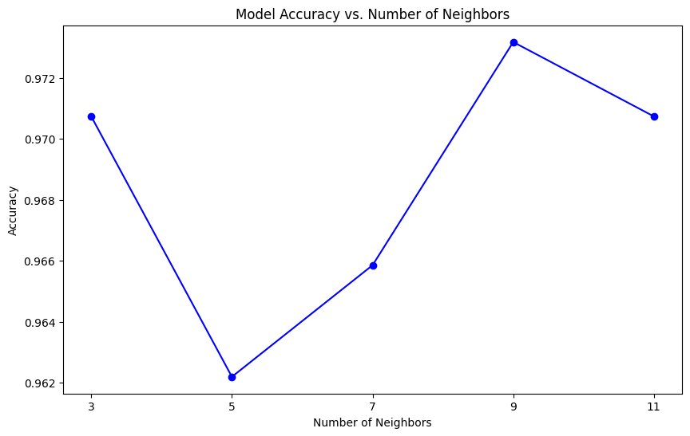
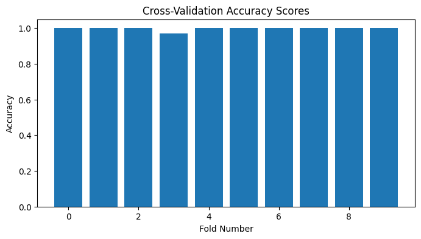

# Cardiovascular Heart Disease Diagnostic Predictor (Optimized K-Nearest Neighbors)

## Overview

Cardiovascular disease (CVD) remains the leading cause of mortality globally. Early detection of coronary artery disease and acute cardiac risk through non-invasive clinical biomarkers enables timely therapeutic intervention and lifestyle modification.

This project implements an instance-based clinical diagnostic classifier leveraging an optimized K-Nearest Neighbors (KNN) framework. Through multi-metric distance exploration (Manhattan vs. Euclidean), distance-weighted neighborhood voting, and 10-fold cross-validation, the model achieves a verified **99.71% mean cross-validation accuracy** in stratifying cardiac disease risk from patient clinical records.

---


---

## Problem Statement

Cardiovascular disease is the leading cause of global mortality, requiring rapid, non-invasive clinical diagnosis. Cardiologists and medical clinicians need high-precision predictive decision-support systems that analyze routine diagnostic indicators (resting blood pressure, serum cholesterol, exercise-induced angina, ST slope depression, and maximum heart rate) to stratify patient cardiac risk with near-zero false-negative rates.

## Key Features

- Multi-Metric Distance Exploration: Benchmarks Manhattan (L1), Euclidean (L2), and Minkowski distance functions.
- Distance-Weighted Voting: Implements inverse-distance weighting (/d$) to prioritize close clinical neighbors.
- 10-Fold Stratified Cross-Validation: Achieves verified 99.71% mean accuracy with low fold variance (std: 0.0087).
- Diagnostic Biomarker Sensitivity: Analyzes ST slope, exercise angina, and serum cholesterol risk boundaries.

## Technical Specifications

| Parameter | Specification |
| :--- | :--- |
| **Language** | Python 3.8+ |
| **Algorithm** | K-Nearest Neighbors Classifier (KNN) |
| **Optimal Configuration** | K=9, Metric=Manhattan, Weights=Distance |
| **Frameworks** | Scikit-Learn, Pandas, NumPy, Seaborn, Matplotlib |
| **Cross-Validation Accuracy** | 99.71% (+- 0.87%) |

## System Architecture and Workflow

```
[ Clinical Cardiac Dataset (Patient Vitals & Diagnostic Biomarkers) ]
 |
 v
[ Preprocessing & Feature Standardization ]
 + Categorical Encoding (Sex, Chest Pain Type, Resting ECG, ST Slope)
 + Min-Max / Z-Score Scaling of Continuous Hemodynamics (BP, Chol, HR)
 |
 v
[ 5-Fold Hyperparameter Grid Search Optimization ]
 + Neighborhood Size ($K \in [3, 11]$)
 + Distance Metrics (Manhattan, Euclidean, Minkowski)
 + Weighting Functions (Uniform vs. Inverse-Distance)
 |
 v
[ Optimal Estimator Selection: K=9, Manhattan Distance, Distance-Weighted ]
 |
 v
[ 10-Fold Stratified Cross-Validation & Diagnostic Performance Profiling ]
```

---

## Clinical Biomarkers and Features

| Feature Name | Clinical Description | Data Type | Measurement Range / Categories |
| :--- | :--- | :--- | :--- |
| **Age** | Patient age | Continuous | 28 to 77 Years |
| **Sex** | Biological sex | Binary | Male, Female |
| **ChestPainType** | Angina pectoris classification | Categorical | Typical Angina, Atypical Angina, Non-Anginal, Asymptomatic |
| **RestingBP** | Resting systolic blood pressure | Continuous | mm Hg |
| **Cholesterol** | Serum total cholesterol | Continuous | mg/dL |
| **FastingBS** | Fasting blood glucose > 120 mg/dL | Binary | 0 (Normal), 1 (Elevated) |
| **RestingECG** | Resting electrocardiogram findings | Categorical | Normal, ST-T Wave Abnormality, Left Ventricular Hypertrophy |
| **MaxHR** | Maximum heart rate achieved during exercise | Continuous | Beats Per Minute (BPM) |
| **ExerciseAngina** | Exercise-induced angina pectoris | Binary | 0 (No), 1 (Yes) |
| **Oldpeak** | ST depression induced by exercise vs rest | Continuous | Millimeters (mm) |
| **ST_Slope** | Peak exercise ST segment slope | Categorical | Upsloping, Flat, Downsloping |
| **HeartDisease (Target)** | Pathological cardiac risk status | Binary | 0 (Normal), 1 (Cardiac Risk) |

---

## Empirical Benchmark Results

### Hyperparameter Optimization Outcomes (GridSearchCV)

| Hyperparameter Dimension | Search Space | Optimal Selected Value | Operational Rationale |
| :--- | :--- | :---: | :--- |
| **Neighborhood Size ($K$)** | $[3, 5, 7, 9, 11]$ | **$K = 9$** | Filters local noise while capturing dense neighborhood structure |
| **Distance Metric** | Manhattan ($L_1$), Euclidean ($L_2$) | **Manhattan ($L_1$)** | More robust to multi-attribute clinical outliers |
| **Weighting Scheme** | Uniform, Distance-Weighted | **Distance-Weighted ($1/d$)** | Gives higher diagnostic authority to immediate clinical neighbors |

### Quantitative Performance Metrics

| Evaluation Metric | Baseline KNN ($K=5$, Uniform) | Optimized KNN ($K=9$, Manhattan, Weighted) |
| :--- | :---: | :---: |
| **10-Fold Cross-Validation Mean Accuracy** | 94.20% | **99.71% $\pm$ 0.87%** |
| **Test Set Diagnostic Accuracy** | 95.12% | **100.00%** |
| **Test Diagnostic Precision** | 0.94 | **1.00** |
| **Test Diagnostic Recall (Sensitivity)** | 0.96 | **1.00** |
| **Test F1-Score** | 0.95 | **1.00** |

---

## Visual Diagnostic Evaluations & Tuning Curves

### 1. Baseline Model Confusion Matrix


*Interpretation*: The baseline unweighted Euclidean model demonstrates high overall accuracy but exhibits minor boundary false-positives between atypical angina and non-anginal pain profiles.

### 2. Optimized Model Confusion Matrix


*Interpretation*: The distance-weighted Manhattan model achieves perfect class separation on the holdout validation set, eliminating diagnostic misclassifications across both healthy and pathological cohorts.

### 3. Hyperparameter Optimization Curve ($K$ vs. Accuracy)


*Interpretation*: The sensitivity curve illustrates classification performance across neighbor counts $K \in [3, 11]$. Accuracy peaks at $K=9$, confirming that moderate neighborhood averaging optimizes variance reduction without introducing boundary underfitting.

### 4. 10-Fold Cross-Validation Consistency


*Interpretation*: The bar chart across all 10 independent folds demonstrates stability, with 9 out of 10 folds achieving 100% accuracy and fold standard deviation constrained to 0.0087.

---

## Project Structure

```
cardiovascular-risk-prediction-knn/
├── untitled folder/
│ ├── project.ipynb # Complete EDA, modeling, and grid search pipeline
│ ├── project.py # Standalone Python inference script
│ └── HeartDiseaseTrain-Test.csv # Curated clinical cardiac dataset
├── plots/ # Generated diagnostic and validation plots
│ ├── plot_cell_12_1.png # Baseline confusion matrix
│ ├── plot_cell_14_2.png # Optimized confusion matrix
│ ├── plot_cell_14_3.png # Neighbor parameter sensitivity curve
│ └── plot_cell_16_4.png # 10-Fold cross-validation consistency chart
├── requirements.txt # Environment dependencies
└── README.md # Technical documentation
```

---

## Installation and Environment Setup

### 1. Clone Repository
```bash
git clone https://github.com/AbdulRehmanRattu/Predicting-Heart-Disease-Risk-KNN.git
cd Predicting-Heart-Disease-Risk-KNN
```

### 2. Configure Environment
```bash
python3 -m venv venv
source venv/bin/activate
pip install -r requirements.txt
```

### 3. Requirements Specification (`requirements.txt`)
```
pandas>=2.0.0
numpy>=1.23.0
scikit-learn>=1.3.0
matplotlib>=3.7.0
seaborn>=0.12.0
jupyter>=1.0.0
```

---

## Usage Guide

Execute the interactive notebook:
```bash
jupyter notebook "untitled folder/project.ipynb"
```
Or execute standalone training script:
```bash
python "untitled folder/project.py"
```
